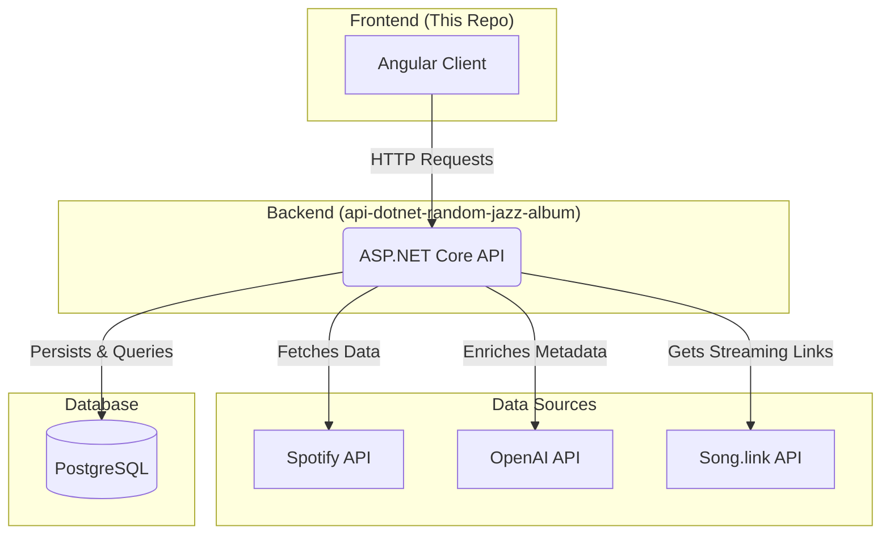

# 🎵 Daily Random Jazz Album - Frontend

This repository contains the frontend client for the Daily Random Jazz Album application. It's an Angular single-page application (SPA) designed to provide users with a new jazz album to discover each day. The application consumes a custom-built backend API, which handles data ingestion and enrichment.

The backend API is in a separate repository: **[api-dotnet-random-jazz-album](https://github.com/ggroshans/api-dotnet-random-jazz-album)**

## 🎯 Project Goal

The primary goal of this application is to encourage music discovery. The frontend's core function is to fetch and display a random, enriched jazz album from the backend API each day. This presents users with an opportunity to listen to something they might not be familiar with or wouldn't typically choose, broadening their musical horizons one album at a time.

## ✨ Core Features

* **Album of the Day:** Displays a random jazz album on the main page load.
* **Dynamic Theming:** The background and UI accent colors dynamically change based on the dominant colors of the album artwork, creating a unique and immersive experience for each album.
* **Rich Album Details:** Shows enriched metadata sourced from the backend, including AI-generated descriptions, moods, and subgenres.
* **State Management:** Utilizes **NgRx** for robust and predictable state management of album, artist, and color theme data.
* **Admin Panel:** Includes a secure admin section for populating the backend database by fetching artist discographies.
* **Responsive Design:** Built with a mobile-first approach to ensure a seamless experience on all devices.

## 🏛️ Full Project Architecture

This is the frontend client in a full-stack project. The backend API acts as the central hub for data aggregation, enrichment, and persistence.



## 💻 Technology Stack

* **Framework:** Angular 19+
* **State Management:** NgRx (Store, Effects, Entity)
* **UI Components:** Angular Material
* **Styling:** SCSS
* **Key Libraries:**
    * `colorthief` for extracting colors from album art.
    * `rxjs` for reactive programming.

## 📂 Project Structure

The application is organized into two main feature modules under the `src/app` directory: `admin` and `client`.

* **`client`**: Contains all public-facing components, services, and state management logic for displaying album and artist data.
    * **`components`**: Smart and presentational components for different views (`album-detail`, `artist-detail`, `home`).
    * **`models`**: TypeScript interfaces for the data structures (`Album`, `Artist`, etc.).
    * **`services`**: Services responsible for making API calls to the backend.
    * **`state`**: NgRx store setup, including actions, reducers, effects, and selectors for each feature slice (`album`, `artist`, `color`).
* **`admin`**: Contains the components and services for the administrative dashboard used to populate the database.

## 🚀 Local Setup & Installation

1.  **Prerequisites:**
    * [Node.js and npm](https://nodejs.org/) (check `package.json` for version)
    * [Angular CLI](https://angular.io/cli)
    * The [backend API](https://github.com/ggroshans/api-dotnet-random-jazz-album) must be running locally.

2.  **Clone the Repository:**
    ```bash
    git clone [https://github.com/ggroshans/fe-angular-random-jazz-album.git](https://github.com/ggroshans/fe-angular-random-jazz-album.git)
    cd fe-angular-random-jazz-album
    ```

3.  **Install Dependencies:**
    ```bash
    npm install
    ```

4.  **Run the Development Server:**
    ```bash
    npm start
    ```
    Navigate to `http://localhost:4200/`. The application will automatically reload if you change any of the source files.

## 📜 Available Scripts

In the project directory, you can run:

* `npm start`: Runs the app in development mode.
* `npm build`: Builds the app for production to the `dist/` folder.
* `npm test`: Launches the test runner in watch mode.
* `npm run watch`: Builds the app in development mode and watches for changes.

